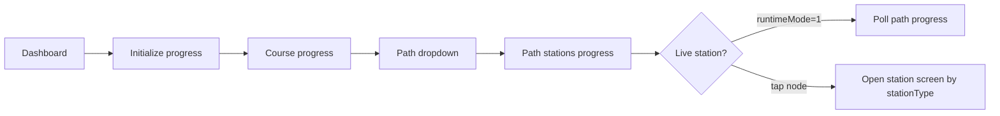

# Progress Path Screen — API Integration Guide

**Figma:** [Learning path / رحلة التفوق](https://www.figma.com/design/uQEYAuTR6ZvhJcrLKM0cTt/Nawabegh?node-id=1698-3045&m=dev)

**Audience:** Web (React) · Flutter · any student client  
**Auth:** `Authorization: Bearer {access_token}` · role **Student** (all endpoints below)

**Base URL:** `https://{api-host}` (no trailing slash)

---

## 1. What this screen shows

The **Progress Path** screen is the visual “رحلة التفوق” map for one **learning path** inside an enrolled course.

| Figma element | Data source |
|---------------|-------------|
| Course title (e.g. الرياضيات: الصف الأول الثانوي) | Enrolled course card or course metadata |
| Path banner — unit + path name + **40% مكتمل** | `GET …/course-progress` + selected path row |
| Station nodes (book, quiz, layers, chest, **live red dot**, challenge, trophy) | `GET …/learning-paths/{id}` — each `stations[]` row |
| Live station timer / “live now” pulse | `stations[].liveSessionSchedule` when `stationType = 0` |
| Locked vs completed vs current node | `stations[].status` + `stationType` |
| Subject tabs (top) | Client navigation — filter by enrolled courses / subjects |

This document covers **only** the APIs needed to build and refresh this screen. Station-specific flows (live room, quiz, flashcards, etc.) have their own `.md` files.

---

## 2. Recommended call order

```text
1.  GET  /api/v1/student/subscriptions/dashboard          → pick course (اشتراكاتي)
2.  POST /api/v1/progress/courses/{courseId}/initialize    → once after enroll (safe to repeat)
3.  GET  /api/v1/progress/courses/{courseId}/course-progress → path list + course % (banner)
4.  GET  /api/v1/learning-paths/courses/{courseId}/dropdown → path selector (if multiple paths)
5.  GET  /api/v1/progress/learning-paths/{learningPathId}   → full station map for UI
    (alias: GET /api/v1/learning-paths/students/{learningPathId}/stations/progress)
6.  Poll step 5 every 30–60s while any live station has runtimeMode = Live (1)
```



---

## 3. Endpoints reference

### 3.1 My subscriptions dashboard

**When:** User opens **اشتراكاتي** and you need course cards + overall stats.

```http
GET /api/v1/student/subscriptions/dashboard
Authorization: Bearer {token}
```

**Response `200` — example**

```json
{
  "status": 200,
  "isSuccess": true,
  "data": {
    "studentName": "أحمد بن فهد",
    "stats": {
      "totalCourses": 3,
      "newCoursesThisMonth": 1,
      "overallProgressPercentage": 42.5,
      "completedCoursesCount": 0,
      "totalLearningHoursApproximate": 12,
      "betterThanPeersPercentile": null
    },
    "courses": [
      {
        "enrollmentId": "3fa85f64-5717-4562-b3fc-2c963f66afa6",
        "courseId": "7c9e6679-7425-40de-944b-e07fc1f90ae7",
        "title": "الرياضيات: الصف الأول الثانوي",
        "thumbnailUrl": "https://{api-host}/uploads/courses/cover.jpg",
        "subjectNameAr": "رياضيات",
        "subjectNameEn": "Mathematics",
        "instructorName": "أ. أحمد محمود",
        "instructorImageUrl": "https://{api-host}/uploads/users/avatar.jpg",
        "progressPercentage": 40.0,
        "isCompleted": false,
        "canViewCertificate": false,
        "certificateUrl": null
      }
    ]
  }
}
```

---

### 3.2 Initialize progress (after enrollment)

**When:** Immediately after free enroll or first open of a newly enrolled course. Creates progress rows for all stations on approved paths.

```http
POST /api/v1/progress/courses/{courseId}/initialize
Authorization: Bearer {token}
```

**Body:** none

**Response `200`**

```json
{
  "status": 200,
  "isSuccess": true,
  "data": null,
  "message": "تم تهيئة التقدم"
}
```

| HTTP | When |
|------|------|
| 401 | Missing/invalid token |
| 403 | Not a student or not enrolled |
| 404 | Course not found |

---

### 3.3 Course-level progress (path banner %)

**When:** Render the dark banner: path title, unit context, **X% مكتمل** for the whole course.

```http
GET /api/v1/progress/courses/{courseId}/course-progress
Authorization: Bearer {token}
```

**Response `200` — example**

```json
{
  "status": 200,
  "isSuccess": true,
  "data": {
    "courseId": "7c9e6679-7425-40de-944b-e07fc1f90ae7",
    "totalPaths": 2,
    "completedPaths": 0,
    "courseProgressPercent": 40,
    "hasFinalExam": true,
    "finalExamPassed": false,
    "canViewCertificate": false,
    "paths": [
      {
        "pathId": "a1b2c3d4-e5f6-7890-abcd-ef1234567890",
        "pathName": "مسار 1: جمع الكسور الاعتيادية",
        "pathProgressStatus": 2,
        "totalStations": 7,
        "completedStations": 2,
        "requiredStations": 6,
        "stationProgressPercent": 33
      }
    ]
  }
}
```

**UI mapping**

| Field | Use on path screen |
|-------|-------------------|
| `paths[].pathId` | Navigate to path map |
| `paths[].pathName` | Banner title |
| `paths[].stationProgressPercent` | **40% مكتمل** on active path |
| `courseProgressPercent` | Optional course-wide ring |
| `hasFinalExam` / `finalExamPassed` | Show final exam node after all paths |

---

### 3.4 Learning path dropdown (optional)

**When:** Course has multiple approved paths — tabs or dropdown before the map.

```http
GET /api/v1/learning-paths/courses/{courseId}/dropdown
Authorization: Bearer {token}
```

**Response `200` — example**

```json
{
  "status": 200,
  "isSuccess": true,
  "data": [
    { "id": "a1b2c3d4-e5f6-7890-abcd-ef1234567890", "name": "مسار 1: جمع الكسور الاعتيادية" },
    { "id": "b2c3d4e5-f6a7-8901-bcde-f12345678901", "name": "مسار 2: طرح الكسور" }
  ]
}
```

**Alternate route (same data):**

```http
GET /api/v1/Course/enrolled/dropdown
GET /api/v1/learning-paths/courses/{courseId}/dropdown
```

---

### 3.5 Path stations progress — **primary screen API**

**When:** Build the winding path, every node, live indicator, lock state.

```http
GET /api/v1/progress/learning-paths/{learningPathId}
Authorization: Bearer {token}
```

**Equivalent:**

```http
GET /api/v1/learning-paths/students/{learningPathId}/stations/progress
Authorization: Bearer {token}
```

**Response `200` — example**

```json
{
  "status": 200,
  "isSuccess": true,
  "data": {
    "learningPathId": "a1b2c3d4-e5f6-7890-abcd-ef1234567890",
    "learningPathTitle": "مسار 1: جمع الكسور الاعتيادية",
    "stations": [
      {
        "stationId": "11111111-1111-1111-1111-111111111111",
        "stationName": "تمهيد الكسور",
        "order": 0,
        "stationType": 4,
        "status": 3,
        "liveSessionSchedule": null
      },
      {
        "stationId": "22222222-2222-2222-2222-222222222222",
        "stationName": "اختبار قصير",
        "order": 1,
        "stationType": 2,
        "status": 3,
        "liveSessionSchedule": null
      },
      {
        "stationId": "33333333-3333-3333-3333-333333333333",
        "stationName": "البث المباشر: مراجعة جمع الكسور",
        "order": 4,
        "stationType": 0,
        "status": 1,
        "liveSessionSchedule": {
          "scheduledAt": "2026-05-12T18:00:00Z",
          "runtimeMode": 1,
          "countdownSeconds": null
        }
      },
      {
        "stationId": "44444444-4444-4444-4444-444444444444",
        "stationName": "تحدي الكسور",
        "order": 5,
        "stationType": 3,
        "status": 0,
        "liveSessionSchedule": null
      }
    ]
  }
}
```

**Node icon mapping (`stationType`)**

| Value | Enum | Figma-style node |
|------:|------|------------------|
| 0 | `LiveStream` | Red broadcast / live dot |
| 1 | `Flashcards` | Stacked cards |
| 2 | `ShortQuiz` | Document + question |
| 3 | `Challenge` | Boxing glove / trophy fight |
| 4 | `HelperResource` | Open book (optional — does not block path) |
| 5 | *(removed)* | Do not use |

**Node state mapping (`status` → `StationProgressStatus`)**

| Value | Name | UI |
|------:|------|-----|
| 0 | `Locked` | Grey / padlock — not tappable |
| 1 | `Available` | Active outline — tappable |
| 2 | `InProgress` | Highlight / partial fill |
| 3 | `Completed` | Green check / gold |
| 4 | `Missed` | Live no-show — offer recording |
| 5 | `Incomplete` | Live attended but below threshold — offer recording |

**Live pulse on path (`liveSessionSchedule`)**

Only present when `stationType = 0` (LiveStream).

| Field | Use |
|-------|-----|
| `scheduledAt` | UTC session start |
| `runtimeMode` | See §4 — drives red dot + timer |
| `countdownSeconds` | Set when `runtimeMode = Upcoming (0)`; null when Live |

**Tap handler**

| `stationType` | Navigate to |
|---------------|-------------|
| 0 | Live session flow → `STATION_LIVE_SESSION.md` |
| 1 | Flashcards flow → `STATION_FLASHCARDS.md` |
| 2 | Quiz flow → `STATION_SHORT_QUIZ.md` |
| 3 | Challenge flow → `STATION_CHALLENGE.md` |
| 4 | Helper resource / PDF viewer → `STATION_HELPER_RESOURCE.md` |

---

### 3.6 Enroll in free course (prerequisite)

**When:** Student purchased/enrolled from explore — required before progress APIs work.

```http
POST /api/v1/student/courses/{courseId}/enroll-free
Authorization: Bearer {token}
```

Then call **§3.2 Initialize**.

---

### 3.7 Course learning paths structure (read-only catalog)

**When:** Optional — show path count before enrollment or admin preview. Returns station summaries **without** student progress.

```http
GET /api/v1/Course/{courseId}/learning-paths
```

Anonymous allowed; student progress still requires §3.5 with auth.

---

## 4. Enums used on this screen

### 4.1 `StationType`

```csharp
LiveStream = 0
Flashcards = 1
ShortQuiz = 2
Challenge = 3
HelperResource = 4
```

### 4.2 `StationProgressStatus`

```csharp
Locked = 0
Available = 1
InProgress = 2
Completed = 3
Missed = 4
Incomplete = 5   // live: attended but below attendance threshold
```

### 4.3 `StudentPathProgressStatus` (course-progress `paths[].pathProgressStatus`)

```csharp
Locked = 0
Available = 1
InProgress = 2
Completed = 3
```

### 4.4 `LiveSessionRuntimeMode` (live nodes only)

```csharp
Upcoming = 0              // countdown — grey/red outline, show countdownSeconds
Live = 1                  // "بث مباشر الآن" — poll path + open live modal
Recorded = 2              // recording available — open VOD screen
EndedWithoutRecording = 3 // ended, no VOD yet — show wait message
```

**Path UI rules for live node**

| `runtimeMode` | Path visual |
|---------------|-------------|
| 0 Upcoming | Optional countdown from `countdownSeconds` |
| 1 Live | Red dot + timer (poll §3.5) |
| 2 Recorded | Normal node; status may be Completed / Incomplete / Missed |
| 3 EndedWithoutRecording | “Processing recording…” state |

---

## 5. Refresh & polling

| Scenario | Action |
|----------|--------|
| User on path map | Poll `GET …/progress/learning-paths/{id}` every **30–60s** if any station has `liveSessionSchedule.runtimeMode === 1` |
| User returns from live room | Immediate refresh of §3.5 + §3.3 |
| After completing any station | Refresh §3.5 (next station may unlock) |
| New CMS stations added | Call `POST …/initialize` **or** rely on §3.5 (server backfills missing rows on read) |

SignalR is **not** used on the path map itself — only inside the live room (`STATION_LIVE_SESSION.md`).

---

## 6. Error handling

| HTTP | Arabic message (examples) | Client action |
|------|---------------------------|---------------|
| 401 | — | Redirect to login |
| 403 | `أنت غير مسجّل في هذه الدورة` | Show enroll CTA |
| 403 | `مسار التعلم غير متاح للطلاب حتى يتم اعتماده` | Hide path |
| 404 | `مسار التعلم غير موجود` | Back to course list |

---

## 7. Standard `Result` wrapper

All responses use:

```json
{
  "status": 200,
  "isSuccess": true,
  "data": { },
  "message": null,
  "errors": null
}
```

Failure:

```json
{
  "status": 403,
  "isSuccess": false,
  "data": null,
  "message": "أنت غير مسجّل في هذه الدورة"
}
```

---

## 8. Related docs

| Doc | Purpose |
|-----|---------|
| `STATION_LIVE_SESSION.md` | LiveStream station — LiveKit + SignalR |
| `STATION_CHALLENGE.md` | Challenge station — queue, duel, SignalR |
| `STATION_HELPER_RESOURCE.md` | HelperResource — files, preview, reading progress |
| `docs/HELPER_RESOURCE_FRONTEND_UPDATE.md` | HelperResource API changes handoff for frontend |
| `STATION_FLASHCARDS.md` | Flashcards station |
| `STATION_SHORT_QUIZ.md` | ShortQuiz station |
| `docs/STUDENT_RAHLA_ALTFOUQ_QA_GUIDE.md` | Full student journey QA |
| `docs/LMS_FRONTEND_API_GUIDE.md` | All LMS endpoints |
| `docs/student-enrollment-api.md` | Checkout / paid enroll |

---

## 9. Checklist for frontend

- [ ] Bearer token on every call
- [ ] Call `initialize` once per enrollment
- [ ] Map `stationType` → icon component
- [ ] Map `status` → locked / active / done styling
- [ ] For `stationType=0`, read `liveSessionSchedule.runtimeMode` for red live badge
- [ ] Poll path progress while live session is active
- [ ] On node tap, route by `stationType` to the correct station screen doc
- [ ] HelperResource (`stationType=4`): use `GET student/helper-resources/stations/{id}` — see `HELPER_RESOURCE_FRONTEND_UPDATE.md`
